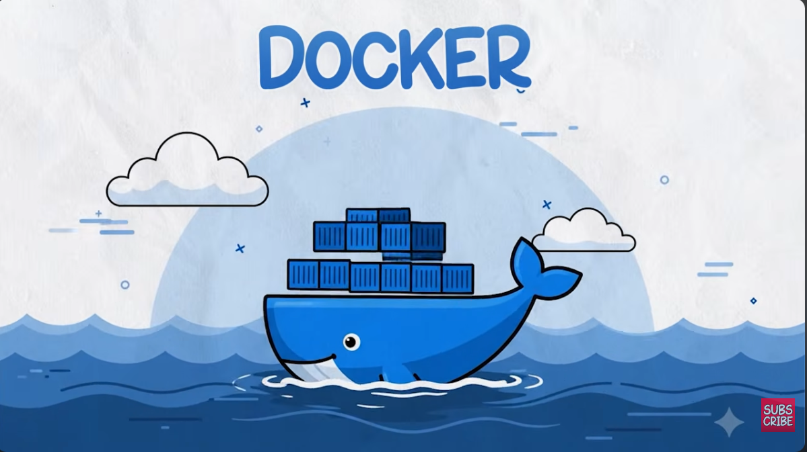

# Docker Mastery Project
### A Hands-On Journey from Docker Basics to CI/CD



This repository is my hands-on Docker learning project, where I take a small
FastAPI application and progressively improve the way it is containerized,
tested, automated, and delivered.

The application remains mostly the same throughout the project. The main focus
is on understanding how Docker practices evolve from a simple container build
to an automated CI pipeline that publishes images to Docker Hub.

---

## Project Goals

The main goals of this project are to understand:

- Docker images and containers
- Dockerfiles and image layers
- Single-stage vs multi-stage builds
- Docker image optimization
- Running containers locally
- Container health checks
- Git and GitHub workflow
- GitHub Actions
- Continuous Integration (CI)
- Using GitHub Secrets
- Automatically building and pushing Docker images

---

# Application

The application is a small **FastAPI** service.

It provides three endpoints:

| Endpoint | Purpose |
|---|---|
| `/` | Returns a welcome message and application status |
| `/health` | Health check endpoint |
| `/info` | Returns application metadata and version |

The application listens on port `8000` inside the container.

Example:

```bash
curl http://localhost:8000/
```

---

## Folder Structure

```text
docker-project1/
├── .github/
│   └── workflows/
│       └── ci.yml          ← actual GitHub Actions workflow
│
├── app/
├── images/
├── Dockerfile
├── Dockerfile-basic
├── Dockerfile-optimized
├── requirements.txt
├── requirements-dev.txt
├── test_main.py
├── DOCKER-INSTALLATION.md
├── EC2-SETUP.md
└── README.md
```

---

## CI/CD Pipeline

The `.github/workflows/ci.yml` workflow automates testing and delivery every time code is pushed:

1. **Checkout & setup** – checks out the repo and sets up Python.
2. **Install & test** – installs `requirements-dev.txt` and runs `test_main.py` against the FastAPI app to catch regressions before anything is built.
3. **Build** – builds the Docker image using the optimized multi-stage `Dockerfile`.
4. **Authenticate** – logs in to Docker Hub using credentials stored as **GitHub Secrets** (never hardcoded).
5. **Push** – tags and pushes the image to Docker Hub, so a working, tested image is published automatically on every merge — no manual `docker build`/`docker push` needed.

---

## Image Size Optimization

| Dockerfile | Base Image | Build Strategy | Key Optimization | Approx. Size |
|---|---|---|---|---|
| `Dockerfile-basic` | `ubuntu:22.04` | Single-stage | Full OS + manually installed Python/pip; nothing trimmed, so build tools and package caches remain in the final image | ~400–600 MB |
| `Dockerfile-optimized` | `python:3.12-slim` | Multi-stage (builder → runtime) | Dependencies are installed in a separate `builder` stage; only the installed packages (`/root/.local`) and app code are copied into the final slim image, leaving compilers/build tools behind | ~150–180 MB |
| `Dockerfile` | `python:3.12-alpine` | Multi-stage, non-root, `HEALTHCHECK` | Same builder/runtime split as above but on minimal Alpine; runs as a non-root `appuser`; adds a container-level `/health` check | ~80–120 MB |

**Why size drops at each step:**
- **Basic → Optimized:** switching from a general-purpose Ubuntu image to a purpose-built slim Python image removes unnecessary OS packages, and the multi-stage build discards pip caches and build dependencies.
- **Optimized → Final:** swapping `slim` for `alpine` shrinks the base OS further, and the non-root user + healthcheck harden the image without adding meaningful size.
